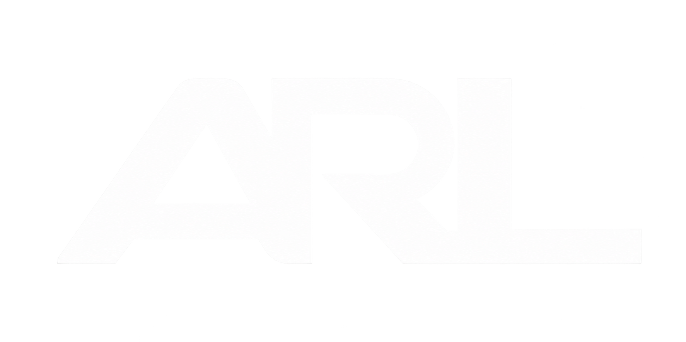
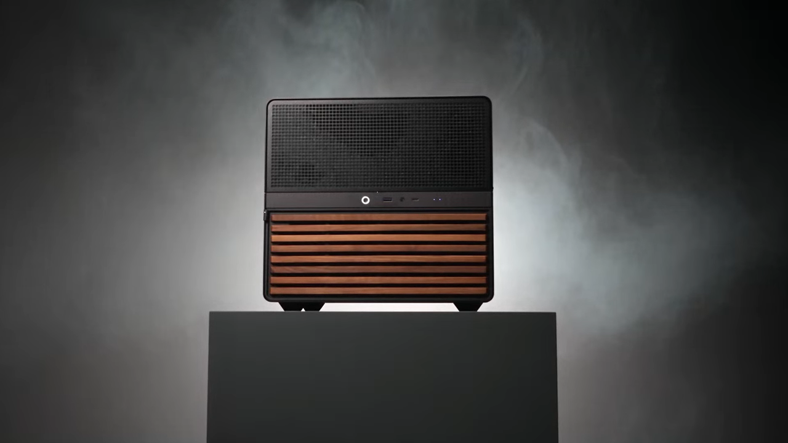

<div align="center">



# ARL3 — Technical Portfolio

A custom-built portfolio documenting homelab infrastructure,
cybersecurity projects, university work, and product engineering.

[View Live Website](https://arl3.com) ·
[Explore the Homelab](https://arl3.com/pages/homelab.html) ·
[View Résumé](https://arl3.com/resources/AbdurRahim-Islam-Resume.pdf)

</div>

---

[](https://arl3.com)

<p align="center">
  <em>Click the image to experience the animated portfolio.</em>
</p>

## Overview

ARL3 is my personal technical portfolio and an evolving record of my
work in infrastructure, cybersecurity, systems administration,
automation, AI, and product design.

Unlike a template-based portfolio, the site was built with custom
HTML, CSS, and JavaScript. It includes an interactive homelab
presentation, animated media, technical project summaries, professional
experience, and university work.

## Project at a Glance

| Area | Details |
|---|---|
| Purpose | Technical portfolio and project documentation |
| Focus | Infrastructure, cybersecurity, automation, and product engineering |
| Technologies | HTML, CSS, JavaScript, Three.js, GitHub Pages |
| Deployment | GitHub Pages with a custom domain |
| Status | Actively maintained |
| Live site | [arl3.com](https://arl3.com) |

## Featured Areas

### Homelab Infrastructure

An interactive presentation of my private infrastructure environment,
including:

- Unraid storage and virtualization
- Dockerized applications
- Tailscale private networking
- Active Directory experimentation
- Wazuh and SIEM practice
- Media automation and security scanning
- Local AI services and workflow automation

[Explore the Homelab →](https://arl3.com/pages/homelab.html)

### Professional Experience

Project and experience summaries covering front-end engineering,
technical support, manufacturing technology, automation, and UX work.

[View Career Experience →](https://arl3.com/Career.dc.html)

### University Work

Relevant coursework, technical development, and academic experience at
Rensselaer Polytechnic Institute.

[View University Work →](https://arl3.com/University.dc.html)

## Technical Highlights

- Custom responsive interface without a site-building platform
- Animated WebM hero with a static fallback poster
- Interactive 3D homelab visualization
- Locally hosted fonts and visual assets
- Reusable design-system styles and components
- Custom domain deployment through GitHub Pages
- Responsive layouts for desktop and mobile devices

## Repository Structure

```text
arl3-site/
├── index.html                 # Main portfolio landing page
├── pages/
│   ├── homelab.html          # Homelab project presentation
│   └── homelab-rig.js        # Interactive rig visualization
├── resources/
│   ├── homelab-loop.webm     # Animated hero media
│   ├── homelab-loop-poster.png
│   ├── design-system.css
│   ├── design-system.js
│   ├── logos/
│   └── fonts/
├── main.css
├── main.js
├── support.js
└── CNAME
